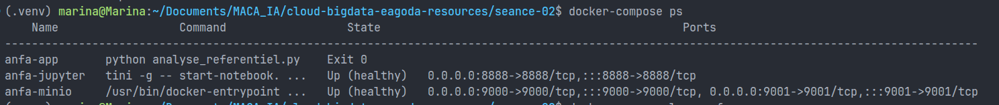
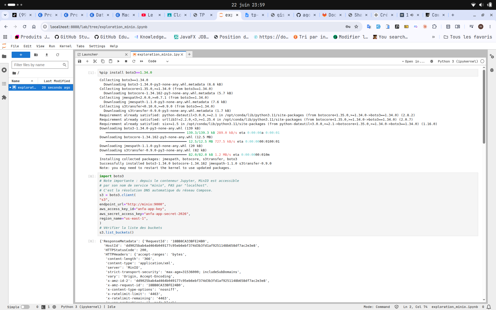
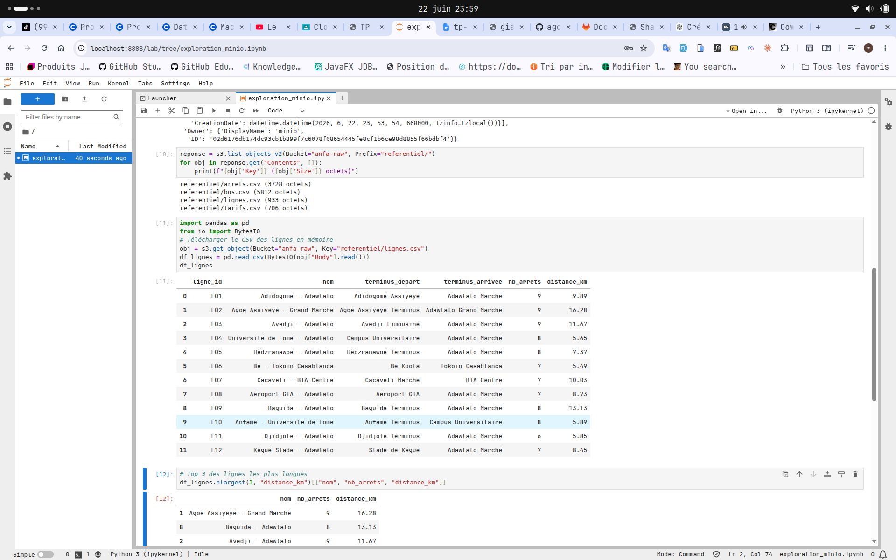

# Rendu - Séance 2
**Nom et prénom :** <AGODA Essokpazim Maca Marina>
**Identifiant GitHub :** <agodaMarina>
**Date de soumission :** <23/06/2026>
## Résumé de la séance
<2-4 lignes : Dockerfile écrit, image construite et exécutée, stack Compose à 3 services orchestrée, notebook Jupyter lisant MinIO.>
## Étapes principales
1. Écriture du Dockerfile et construction de l'image `anfa-analyse:v1` (taille observée : XX Go).
2. Mise en place du `.dockerignore` et observation du cache de Docker.
3. Écriture du `docker-compose.yml` orchestrant MinIO, Jupyter, et l'image custom.
4. Création du notebook `exploration_minio.ipynb` qui lit les données depuis MinIO via boto3 et pandas.
## Captures d'écran
### docker compose ps

### Notebook Jupyter

## Bonus multi-stage (optionnel)
<Si réalisé : taille image v1 vs taille image v2-multistage, gain en pourcentage.>
## Réponses aux exercices d'application
Exercice 1 : QCM conceptuel
1.1 → C

Un conteneur partage le noyau de l'hôte, contrairement à une VM qui embarque son propre noyau.
1.2 → B

L'image est un modèle figé en lecture seule ; le conteneur est l'instance vivante créée à partir de cette image.
1.3 → B

Docker utilise les namespaces pour isoler les processus, le réseau, le système de fichiers de chaque conteneur.
1.4 → A

Docker utilise les cgroups pour limiter et contrôler les ressources (CPU, RAM) allouées à un conteneur.
1.5 → B

Sous macOS, Docker Desktop crée une machine virtuelle Linux légère en arrière-plan pour faire tourner les conteneurs.
1.6 → B

DotCloud est la startup qui a créé Docker et l'a rendu open-source en 2013.
1.7 → C

Docker n'a pas inventé les namespaces ni les cgroups, mais a apporté un format d'image portable, une CLI simple et Docker Hub.
1.8 → B

OCI (Open Container Initiative) est le standard ouvert qui définit le format des images et le comportement des runtimes de conteneurs.

Exercice 2 : Analyse du Dockerfile
2.1 — Rôle de chaque instruction

FROM python:3.11 : définit l'image de base, ici Python 3.11 officielle.
WORKDIR /application : crée et définit le répertoire de travail dans le conteneur.
COPY . /application : copie tout le contenu du projet local dans le conteneur.
RUN pip install -r requirements.txt : installe les dépendances Python dans l'image.
EXPOSE 5000 : documente que l'application écoute sur le port 5000 (information, pas une ouverture réelle).
CMD ["python", "main.py"] : définit la commande lancée au démarrage du conteneur.

2.2 — EXPOSE vs -p
EXPOSE 5000 est purement documentaire, il n'ouvre rien. L'option -p 5000:5000 de docker run est ce qui mappe réellement le port du conteneur vers un port de la machine hôte.
2.3 — Deux problèmes

Image trop lourde : python:3.11 pèse ~900 Mo. Il faut utiliser python:3.11-slim pour réduire la taille.
Mauvais ordre des instructions : COPY . /application est fait avant pip install, donc chaque modification du code invalide le cache et force une réinstallation des dépendances. Il faut copier requirements.txt en premier, installer les dépendances, puis copier le reste du code.

2.4 — Dockerfile corrigé
dockerfileFROM python:3.11-slim

WORKDIR /application

# Copier uniquement requirements.txt en premier pour optimiser le cache
COPY requirements.txt .
RUN pip install --no-cache-dir -r requirements.txt

# Copier le reste du code ensuite
COPY . .

# Créer et utiliser un utilisateur non-root
RUN useradd -m appuser
USER appuser

EXPOSE 5000
CMD ["python", "main.py"]

Exercice 3 : Diagnostic
3.1 — Le build qui échoue
a. Le RUN pip install -r requirements.txt est exécuté avant le COPY . ., donc requirements.txt n'existe pas encore dans le conteneur au moment de l'installation.
b. Il faut copier les fichiers avant de les utiliser :
dockerfileFROM python:3.11-slim
WORKDIR /app
COPY . .
RUN pip install -r requirements.txt
CMD ["python", "main.py"]
c. Cela montre une confusion entre le système de fichiers local et celui du conteneur. Pendant le build, Docker travaille dans un contexte isolé — un fichier n'existe dans le conteneur que si on l'y a copié avec COPY ou ADD au préalable.

3.2 — Le conteneur qui ne voit pas l'autre
a. L'erreur est dans l'adresse localhost : dans Docker Compose, chaque service est un conteneur séparé, et localhost désigne le conteneur api lui-même, pas le conteneur db.
b. Il faut remplacer localhost par le nom du service défini dans le Compose :
DATABASE_URL: "postgresql://user:password@db:5432/anfa"

Exercice 4 : Optimisation d'image
a — Quatre problèmes identifiés

Image de base trop lourde : ubuntu:22.04 embarque tout un OS alors qu'on a juste besoin de Python.
Plusieurs RUN séparés : chaque RUN crée un layer Docker distinct, ce qui gonfle inutilement la taille de l'image finale.
Outils inutiles installés : curl, wget, git, build-essential ne servent pas pour une simple installation de requests — ils alourdissent et élargissent la surface d'attaque.
Aucun utilisateur non-root : le conteneur tourne en root par défaut, ce qui est un risque de sécurité si le conteneur est compromis.

b — Dockerfile optimisé
dockerfile# Image légère avec Python déjà inclus
FROM python:3.11-slim

WORKDIR /app

# Copier requirements en premier pour bénéficier du cache Docker
COPY requirements.txt .

# Fusionner les commandes apt et pip en un seul RUN pour réduire les layers
# --no-cache-dir évite de stocker le cache pip dans l'image
RUN pip install --no-cache-dir -r requirements.txt

# Copier le code applicatif après les dépendances
COPY downloader.py .

# Créer un utilisateur non-root pour la sécurité
RUN useradd -m appuser
USER appuser

CMD ["python", "downloader.py"]

Exercice 5 : Mini-cas d'architecture
a — Services à conteneuriser
ServiceRôlepipelineScript Python qui lit le FTP, nettoie les données et écrit dans MinIOminioStockage objet qui reçoit les fichiers agrégés et les expose à JupyterjupyterEnvironnement d'exploration des données stockées dans MinIO
b — Restart policy pour le script pipeline
on-failure est le meilleur choix. Le script a une durée de vie courte (il tourne, termine, et s'arrête) — always ou unless-stopped le relanceraient en boucle après chaque fin normale d'exécution, ce qui n'est pas le comportement voulu.
c — Passer la date au script

Mécanisme 1 — Variable d'environnement : docker run -e DATE=2026-06-25 pipeline — le script lit os.environ["DATE"].
Mécanisme 2 — Argument de commande : surcharger le CMD au lancement : docker run pipeline python main.py 2026-06-25.

Recommandation : la variable d'environnement, car elle s'intègre naturellement dans Compose avec environment: sans modifier la commande.
d — Pourquoi ne pas mettre le script dans Jupyter ?
Ce n'est pas une bonne pratique car cela mélange deux responsabilités distinctes dans un seul conteneur (principe de responsabilité unique). Le conteneur Jupyter deviendrait plus lourd, plus difficile à maintenir, et on ne pourrait pas relancer le pipeline indépendamment. En séparant les deux, on peut versionner, tester et redéployer chacun sans impacter l'autre.
e — Squelette docker-compose.yml
yamlversion: "3.8"

services:

  minio:
    image: minio/minio:latest
    environment:
      MINIO_ROOT_USER: anfa-admin
      MINIO_ROOT_PASSWORD: anfa-password
    volumes:
      - minio-data:/data
    command: server /data --console-address ":9001"

  pipeline:
    build: ./pipeline
    environment:
      DATE: "2026-06-25"
      MINIO_ENDPOINT: "http://minio:9000"
    depends_on:
      - minio
    restart: on-failure

  jupyter:
    image: jupyter/scipy-notebook:latest
    environment:
      MINIO_ENDPOINT: "http://minio:9000"
    volumes:
      - ./notebooks:/home/jovyan/work
    ports:
      - "8888:8888"
    depends_on:
      - minio

volumes:
  minio-data:
## Difficultés rencontrées
J'ai eu des difficulté sur la fin du tp pour accéder à minio mais j'ai pu les resoudres car c'étaot lié à mes credentials denifie au tp précédent

