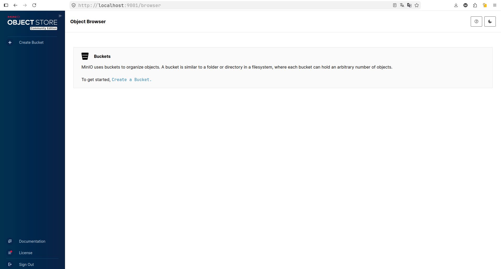
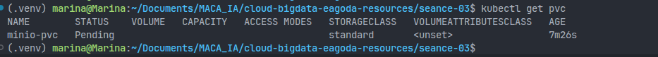
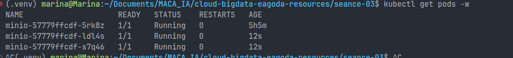

# Rendu Séance 3
**Nom et prénom :** <Votre nom complet>
**Identifiant GitHub :** <votre-username>
**Date de soumission :** <JJ/MM/AAAA>
## Résumé de la séance
<2-4 lignes : Kind installé, cluster Kubernetes créé, namespace anfa configuré, MinIO déployé via 3 manifestes YAML, self-healing observé, scaling testé, Ingress Controller activé.>
## Étapes principales
1. Installation de Kind et kubectl, création du cluster `anfa`.
2. Création du namespace `anfa` et configuration de kubectl.
3. Déploiement de MinIO via 3 manifestes YAML (PVC, Deployment, Service).
4. Observation du self-healing après suppression manuelle d'un pod.
5. Scaling du Deployment de 1 à 3 replicas, puis retour à 1.
6. Activation de l'Ingress Controller nginx.
## Captures d'écran
### Console MinIO accessible via port-forward

### Self-healing observé

### Scaling à 3 replicas

## Réponses aux exercices d'application
Exercice 1 : QCM conceptuel
1.1  B

Kubernetes orchestre des conteneurs en s'appuyant sur un container runtime (containerd, Docker, CRI-O), il ne remplace pas Docker.
1.2  B

etcd est la base de données clé-valeur qui stocke l'état complet du cluster.
1.3  C

Le Scheduler est responsable de décider sur quel nœud placer un nouveau pod selon les ressources disponibles.
1.4  C

kubectl parle à l'API Server, qui est le seul point d'entrée du cluster.
1.5  B

Le Deployment détecte qu'un pod manque et en recrée un automatiquement pour maintenir le nombre de replicas souhaité.
1.6  B

NodePort expose un service sur un port de chaque nœud du cluster, sans nécessiter un load balancer cloud.
1.7 B

La commande modifie l'état souhaité à 5 replicas ; Kubernetes ajuste ensuite le nombre réel de pods.
1.8 B

Un Namespace isole logiquement les ressources, par exemple pour séparer les environnements dev/prod ou les équipes.
1.9  B

Avec Kind (Kubernetes IN Docker), chaque nœud est en réalité un conteneur Docker.

Exercice 2 : Lecture du manifeste
2.1

selector.matchLabels indique au Deployment quels pods il doit gérer. Il doit correspondre exactement à template.metadata.labels, sinon le Deployment ne reconnaît pas ses propres pods.
2.2

2 pods seront créés (replicas: 2). Si l'un meurt, le Deployment en recrée un automatiquement pour revenir à 2.
2.3

minio est le nom DNS d'un Service Kubernetes. Le DNS interne du cluster résout automatiquement ce nom vers l'IP du Service MinIO, donc pas besoin d'IP fixe.
2.4

Sans Service, l'API est inaccessible depuis l'extérieur des pods. Aucun autre composant du cluster ni utilisateur ne peut la joindre.
2.5
yamlapiVersion: v1
kind: Service
metadata:
  name: anfa-api
  namespace: anfa
spec:
  selector:
    app: anfa-api
  ports:
    - port: 80
      targetPort: 8000
  type: ClusterIP

Exercice 3 : Diagnostic
3.1
a. ImagePullBackOff signifie que Kubernetes n'arrive pas à télécharger l'image depuis le registry.
b. Le nom de l'image est mal écrit : miniooo au lieu de minio.
c. kubectl describe pod minio-7d9f8b6c5-x2k9p affiche les événements et le message d'erreur précis.

3.2
a. Pending signifie que le PVC attend d'être lié à un PersistentVolume disponible.
b. Dans Kind, il n'existe pas de PersistentVolume capable de fournir 500Gi — la capacité demandée est trop grande pour un cluster local.
c. kubectl describe pvc data-pvc montre pourquoi aucun volume ne correspond.

3.3
a. Le port-forward nécessite un pod en état Running ; ici le pod est encore en Pending.
b. kubectl describe pod <nom-du-pod> ou kubectl get events pour voir pourquoi il est bloqué.
c. Il faut vérifier que le pod est bien Running avant de lancer le port-forward.

Exercice 4 : Docker Compose → Kubernetes
4.1

Il faut 4 manifestes :

Deployment : lance le conteneur MinIO
Service : expose MinIO à l'intérieur (et/ou à l'extérieur) du cluster
PersistentVolumeClaim : réclame le stockage persistant
Secret (recommandé) : stocke les credentials MINIO_ROOT_USER et MINIO_ROOT_PASSWORD

4.2

Un volume Docker nommé est géré localement par Docker sur une seule machine, sans notion de capacité ni de politique de stockage. Un PVC Kubernetes est une demande de stockage déclarative : Kubernetes cherche un PersistentVolume qui correspond (taille, mode d'accès) et peut provisionner du stockage réseau partagé sur un cluster multi-nœuds.
4.3

Avec Docker Compose, le port est directement exposé sur localhost de la machine hôte. Avec Kind, les nœuds sont des conteneurs Docker eux-mêmes, donc le NodePort n'est pas accessible directement depuis l'hôte — il faut un port-forward pour créer un tunnel. Pour accéder directement comme avec Compose, il faudrait configurer Kind avec extraPortMappings.
4.4

Auto-récupération : si le pod MinIO plante, Kubernetes le redémarre automatiquement sans intervention manuelle.
Scalabilité : on peut augmenter le nombre de replicas avec une seule commande (kubectl scale), ce qui est impossible nativement avec Compose.

Exercice 5 : Mini-cas d'architecture
5.1

pipeline-anfa → CronJob : tâche planifiée chaque nuit à 2h, durée limitée, s'arrête après exécution.
anfa-api → Deployment : service web permanent, toujours disponible, sans état persistant propre.
anfa-dashboard → Deployment : application web sans état, disponibilité standard, pas besoin de garanties fortes.

5.2
minReplicas: 2
maxReplicas: 10
métrique cible: CPU à 60%
Avec 2 replicas minimum, l'API reste disponible même en basse charge. Aux heures de pointe (×10 le trafic), l'HPA monte automatiquement jusqu'à 10 replicas, puis redescend après.
5.3

LoadBalancer — l'API doit être accessible depuis les applications mobiles des conducteurs (trafic externe), et on est sur un cloud managé qui peut provisionner un vrai load balancer.
5.4

Par défaut, Kubernetes utilise une stratégie RollingUpdate : il crée de nouveaux pods avec la nouvelle version avant de supprimer les anciens. À aucun moment tous les pods ne sont indisponibles en même temps. Les requêtes continuent d'être servies par les anciens pods pendant la transition, ce qui garantit zéro coupure.
5.5
yamlapiVersion: apps/v1
kind: Deployment
metadata:
  name: anfa-api
  namespace: anfa
spec:
  replicas: 3
  selector:
    matchLabels:
      app: anfa-api
  template:
    metadata:
      labels:
        app: anfa-api
    spec:
      containers:
        - name: api
          image: anfa/api:v1
          ports:
            - containerPort: 8000
          env:
            - name: MINIO_ENDPOINT
              value: "http://minio:9000"
## Difficultés rencontrées
<Aucune | Décrivez brièvement.>
