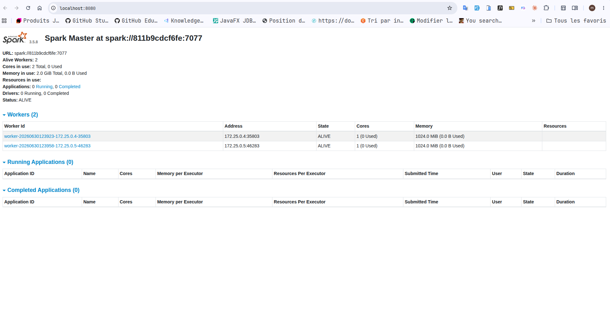
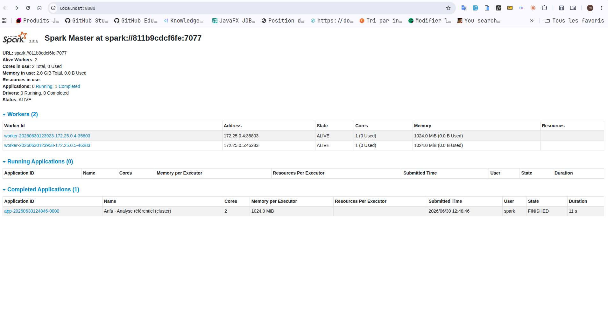
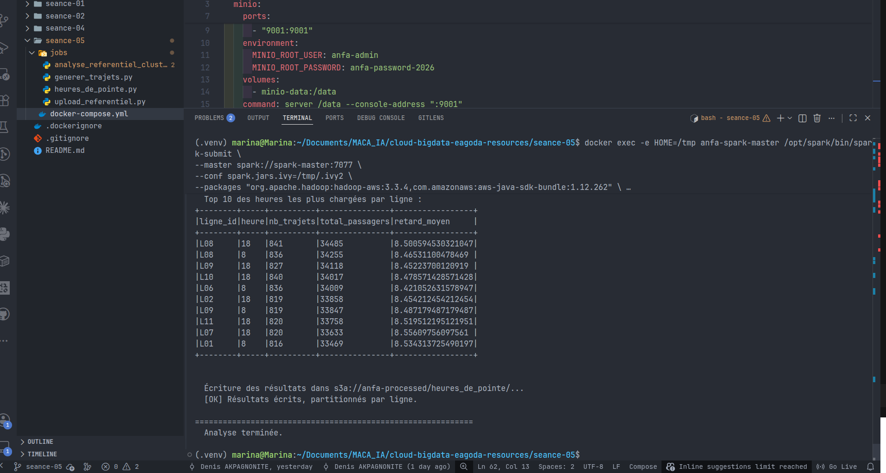
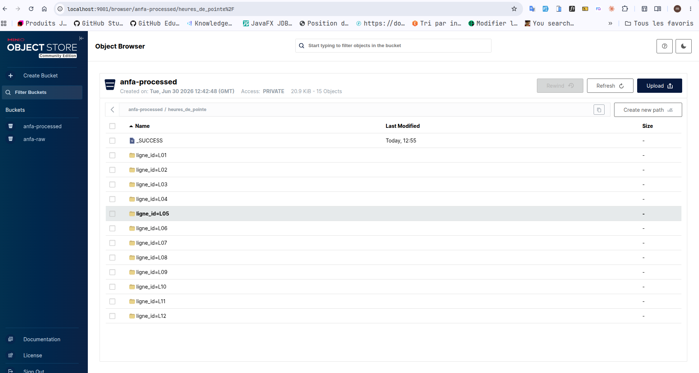

# Rendu Séance 5
**Nom et prénom :** <Votre nom complet>
## Résumé de la séance
<2-4 lignes : cluster Spark déployé via Compose, jobs PySpark distribués exécutés, données lues depuis MinIO et résultats écrits en Parquet, comparaison local vs cluster.>
## Étapes principales
1. Déploiement du cluster Spark standalone (1 master + 2 workers) via Docker Compose.
2. Préparation de MinIO et upload du référentiel.
3. Premier job distribué (`analyse_referentiel_cluster.py`) : statistiques de base.
4. Génération d'un historique simulé de trajets et job d'analyse des heures de pointe.
5. Comparaison subjective entre mode local et mode cluster.
## Captures d'écran
### Dashboard Spark Master avec 2 workers

### Application Spark exécutée avec succès

### Résultats du Top 10 dans la console

### Bucket anfa-processed avec heures_de_pointe partitionné

## Réflexion : local vs cluster
<Vos observations subjectives : durée perçue, expérience, dans quel cas vous utiliseriez l'un ou l'autre.>
## Bonus Spark sur Kubernetes
<Réalisé : non.>
## Réponses aux exercices d'application
<À compléter d'après les énoncés fournis avec l'assignment.>
## Difficultés rencontrées
<Aucune | Décrivez brièvement.>
