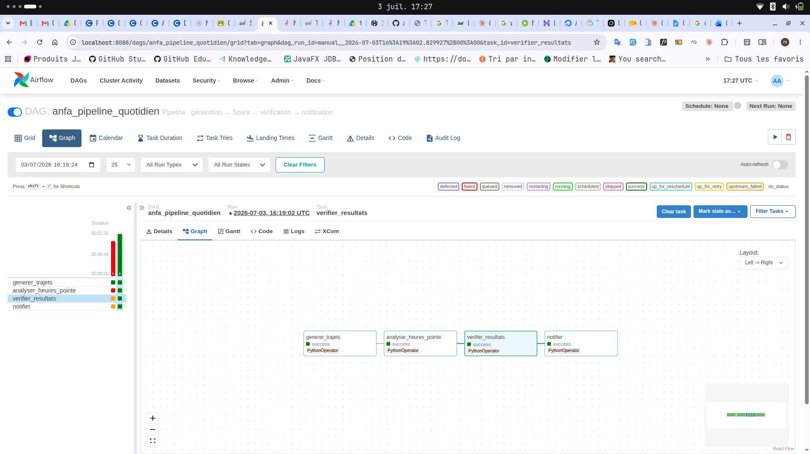
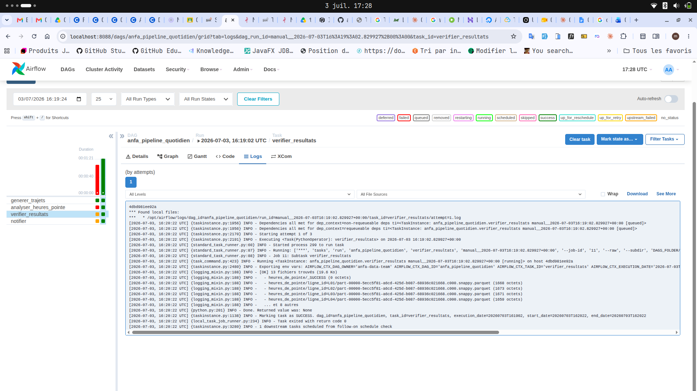
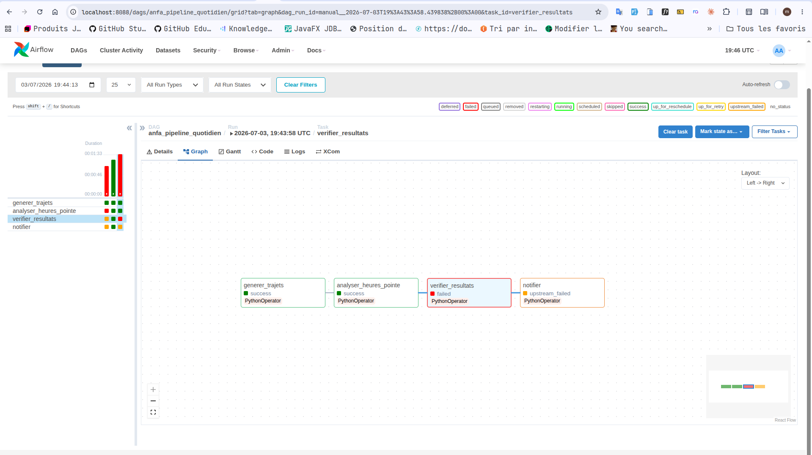

# Rendu : Séance 6

**Nom et prénom :** AGODA Essokpazim Maca Marina
**Identifiant GitHub :** <AgodaMarina>
**Date de soumission :** <03/07/2026>

## Résumé de la séance

Airflow déployé via Docker Compose aux côtés de MinIO et Spark. Un premier DAG
simple (`hello_anfa`) a servi à comprendre la mécanique, puis un DAG métier
(`anfa_pipeline_quotidien`) orchestre le pipeline de la séance 5 :
génération → analyse Spark → vérification → notification. Les retries et la
propagation d'échec ont été observés via un bug volontaire.

## Étapes principales

1. Déploiement de la stack (Airflow + PostgreSQL + MinIO + Spark) via Docker Compose.
2. Premier DAG `hello_anfa` à 2 tâches : initiation à la mécanique Airflow.
3. DAG métier `anfa_pipeline_quotidien` à 4 tâches : génération → Spark → vérification → notification.
4. Démonstration des retries et de la gestion d'erreur via un bug volontaire.

## Captures d'écran

### UI Airflow après connexion (vue d'accueil)

### DAG hello_anfa exécuté en succès

### DAG anfa_pipeline_quotidien complet en succès

### Logs de la tâche `verifier_resultats`

### Démonstration du retry : tâche en échec et propagation

## Réflexion personnelle

<3-5 lignes : qu'apporte Airflow par rapport à un cron simple ?
Dans quel cas l'utiliser sur un vrai projet ?>

## Difficultés rencontrées

<j'ai demarré mon fihcier deckoer compose mais j'ai l'erreur  ERROR: for airflow-init  Container "8dde41438794" is unhealthy.
ERROR: Encountered errors while bringing up the project. l'image postgres:18-alpine refuse de démarrer. Postgres 18+ a changé son format de stockage et l'ancien volume postgres-data (créé avec une image Postgres antérieure) est monté au mauvais endroit, ce qui fait crasher Postgres en boucle → jamais "healthy" → airflow-init (qui dépend de lui) reste bloqué.>
